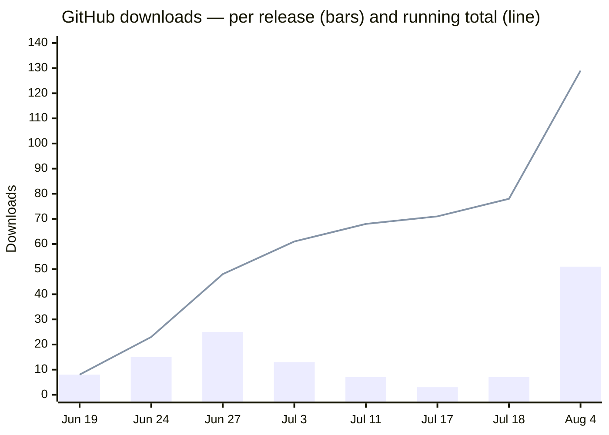

# lockinra-site

The public website for **LockinRa** — [lockinra.xyz](https://lockinra.xyz) — and the home of its public
releases. The app itself lives in a private repo; every downloadable build is published here under
[Releases](https://github.com/0xabhilok/lockinra-site/releases).

---

## Downloads

**231 total downloads** across every channel, as of 2026-08-11.

| Channel | Downloads | Share |
| --- | ---: | ---: |
| GitHub Releases (Windows, macOS, Linux) | 129 | 56% |
| [Microsoft Store](https://apps.microsoft.com/detail/9N6KKXPCV2JW) (Windows) | 102 | 44% |
| **Total** | **231** | |

### Over time



Read this as *downloads attributed to the release published on that date*, not downloads that happened
on that date — GitHub reports one lifetime counter per file and no timestamps, so a v1.0.0 download
could have happened yesterday. Jul 17 combines v1.5.0 and its same-day hotfix v1.5.1. The Microsoft
Store's 102 is a single lifetime figure with no date breakdown, so it can't be plotted here.

### By release

| Release | Date | Windows | macOS | Linux | Total |
| --- | --- | ---: | ---: | ---: | ---: |
| v1.7.0 — first macOS build, Linux brought current | 2026-08-04 | 17 | 19 | 15 | **51** |
| v1.6.0 | 2026-07-18 | 7 | — | — | 7 |
| v1.5.1 — same-day hotfix | 2026-07-17 | 1 | — | — | 1 |
| v1.5.0 | 2026-07-17 | 2 | — | — | 2 |
| v1.4.0 | 2026-07-11 | 7 | — | — | 7 |
| v1.3.0 | 2026-07-03 | 7 | — | 6 | 13 |
| v1.2.0 | 2026-06-27 | 23 | — | 2 | **25** |
| v1.1.0 | 2026-06-24 | 12 | — | 3 | 15 |
| v1.0.0 | 2026-06-19 | 8 | — | — | 8 |

40% of all GitHub downloads belong to v1.7.0, which has only been out a week. Windows was the only
platform available for the first two releases and again for v1.4.0–v1.6.0, so the platform totals below
are not a like-for-like comparison — see the v1.7.0 row for the one release that shipped everywhere at once.

### By platform

| Platform | GitHub | Store | Total | Share |
| --- | ---: | ---: | ---: | ---: |
| Windows | 84 | 102 | **186** | 81% |
| Linux | 26 | — | 26 | 11% |
| macOS | 19 | — | 19 | 8% |

On v1.7.0 — the only release offered on all three platforms simultaneously — the split is macOS 19,
Windows 17, Linux 15. The macOS build is one week old and has already out-downloaded that release's
Windows files.

### By installer format

| Format | Platform | Downloads | Share |
| --- | --- | ---: | ---: |
| `.exe` (NSIS) | Windows | 75 | 58% |
| `.AppImage` | Linux | 16 | 12% |
| `.dmg` | macOS | 13 | 10% |
| `.zip` | macOS | 6 | 5% |
| `.deb` | Linux | 5 | 4% |
| `.rpm` | Linux | 5 | 4% |
| `.msi` | Windows | 5 | 4% |
| `.appx` | Windows | 4 | 3% |

The `.exe` is what the site's Windows download button points to, which is a large part of why it
dominates; the other formats are one click deeper on the downloads hub. The 4 `.appx` downloads are the
store package pulled straight from GitHub — separate from the 102 the Store counts itself.

### Bandwidth

**31.1 GB** (29.0 GiB) served from Releases across 24 installer assets. Individual installers run
189–352 MB, median 272 MB.

---

## Release cadence

| | |
| --- | ---: |
| Releases published | 9 |
| First → latest (v1.0.0 → v1.7.0) | 46 days |
| Average gap between releases | 5.7 days |
| Longest gap | 17 days (v1.6.0 → v1.7.0, the macOS + Linux release) |
| Shortest gap | same day (v1.5.0 → v1.5.1 hotfix) |
| Installer assets published | 24 |

## Repo traffic

Rolling 14-day window, as of 2026-08-11 — GitHub keeps no longer history, and reading it needs push
access on the repo.

| | Total | Unique |
| --- | ---: | ---: |
| Clones | 31 | 20 |
| Views | 16 | 4 |

Top referrer: `github.com` (13 views, 3 unique).

---

## Counting notes

- GitHub numbers are **installer assets only** — the four downloads of `SHA256SUMS.txt` are excluded.
  Including it, the raw asset total is 133.
- GitHub counts every fetch of a file, so re-downloads, mirrors and bots are in there too. There is no
  unique-downloader figure and no per-day breakdown.
- The **Microsoft Store** figure is read from Partner Center and has to be updated by hand — there is no
  API behind it here. It is lifetime installs, undated.
- Percentages are rounded, so columns may not total exactly 100.
- The site itself ships no analytics, so there are no visitor numbers to report.

### Refreshing these numbers

```bash
gh api repos/0xabhilok/lockinra-site/releases --paginate --jq '[.[].assets[] | select(.name != "SHA256SUMS.txt") | .download_count] | add'
```

Per release:

```bash
gh api repos/0xabhilok/lockinra-site/releases --paginate --jq '.[] | "\(.tag_name)\t\(.published_at[0:10])\t\([.assets[] | select(.name != "SHA256SUMS.txt") | .download_count] | add // 0)"'
```

Traffic:

```bash
gh api repos/0xabhilok/lockinra-site/traffic/clones --jq '{total: .count, unique: .uniques}'
```

---

## The site

Static HTML, no build step — GitHub Pages serves this directory as-is at the domain in `CNAME`.

| File | Page |
| --- | --- |
| `index.html` | Landing page |
| `download.html` | Downloads hub — all three platforms |
| `mac.html` / `linux.html` | Platform-specific install guides |
| `support.html`, `support.js` | Support page |
| `privacy.html` | Privacy policy |
| `sitemap.xml`, `robots.txt`, `site.webmanifest` | Site metadata |
